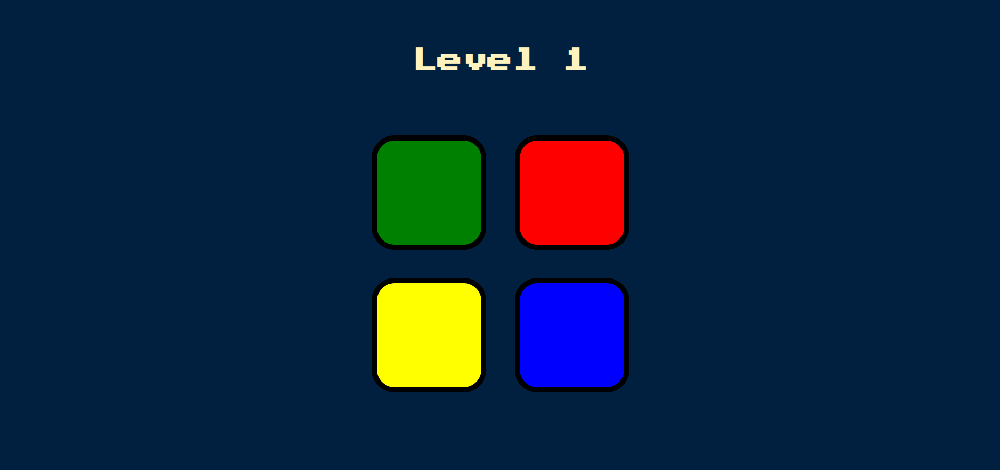

# Simon-Game 🚦

## Inventors 👨‍💻
This is a Simon game, an electronic game of memory skill invented by Ralph H. Baer and Howard J. Morrison, working for toy design firm Marvin Glass and Associates, with software programming by Lenny Cope. The device creates a series of tones and lights and requires a user to repeat the sequence. If the user succeeds, the series becomes progressively longer and more complex.

## Technologies

build it using HTML, CSS, JavaScript and Jquery.

## Try It Out
Play the [Simon Game](https://kapansa.github.io/Simon-Game/)
